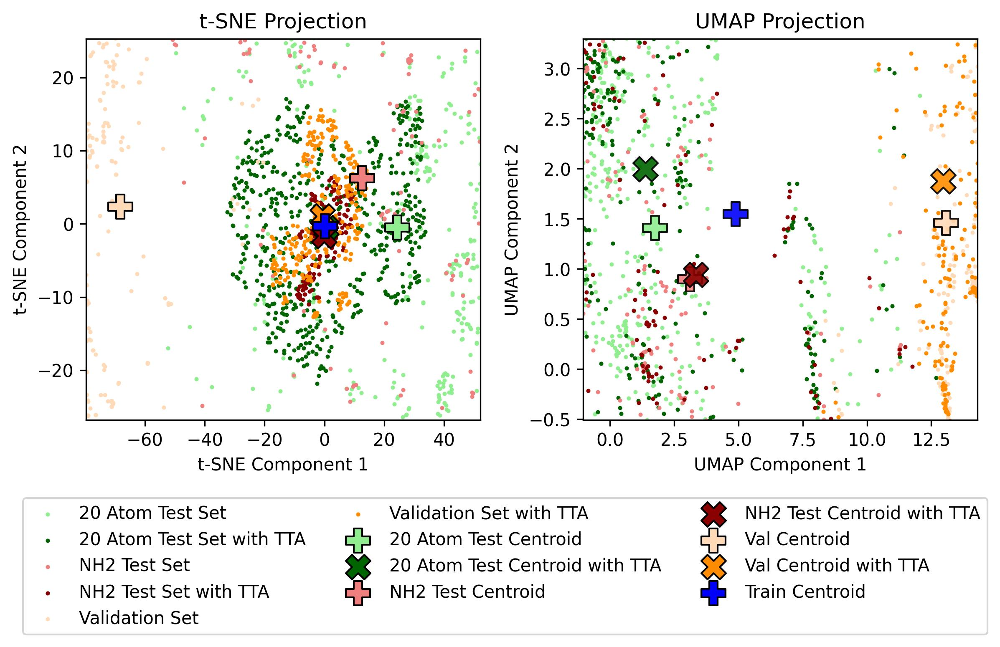

# Test-time Adaptation for Graph-based Molecular Solubility Prediction

This repository investigates applying graph neural networks (GNNs) to predict molecular solubility of unseen data, using test-time adaptation (TTA).

---

<p align="center">
  
</p>

<p align="center">
  
</p>

---

## Overview

Molecular solubility prediction is a critical task in drug development, but models often struggle with distribution shifts between training and test data. This project addresses this challenge by implementing test-time adaptation for graph neural networks and applying it to molecular solubility prediction.

This project was carried out as part of the seminar **165.164 Selected Topics in Theoretical Chemistry** at TU Wien, under the supervision of [Prof. Esther Heid](https://hesther.github.io/).

### Key Features
- Loading and preprocessing molecular graphs from CSV files
- Y-shaped GNN architecture with shared encoder and two task-specific heads
- Combined supervised and self-supervised learning
- Test-time adaptation for improved generalization on unseen data
- Comprehensive performance analysis and visualization

### Related work
- Cui, T., et al. "Online test-time adaptation for better generalization of interatomic potentials to out-of-distribution data." *Nature Communications* 16, 1891 (2025). [DOI](https://doi.org/10.1038/s41467-025-57101-4)
- Zhang, K., et al. "A survey of deep graph learning under distribution shifts." *arXiv preprint* (2024). [arXiv:2410.19265](https://arxiv.org/abs/2410.19265)
- Wang, Y., et al. "Test-time training for graph neural networks." *arXiv preprint* (2022). [arXiv:2210.08813](https://arxiv.org/abs/2210.08813)

### Data source
- Llompart, P., et al. "Will we ever be able to accurately predict solubility?" *Scientific Data* 11, 303 (2024). [DOI](https://doi.org/10.1038/s41597-024-03105-6)
- Sorkun, M. C., et al. "AqSolDB, a curated reference set of aqueous solubility and 2D descriptors for a diverse set of compounds." *Scientific Data* 6, 143 (2019). [DOI](https://doi.org/10.1038/s41597-019-0151-1)

---

## Getting Started

### 1. Clone the Repository
```bash
git clone https://github.com/p0017/Molecular-Test-Time-Adaptation.git
cd Molecular-Test-Time-Adaptation
```

### 2. Set up the Environment
Create and activate the conda environment. This could take a few minutes. 
```bash
conda env create -f environment.yml
conda activate molecular
```

### 3. Configure and Run
Open `Molecular-Test-Time-Adaptation.ipynb` and configure the following parameters.

| Parameter | Description |
|-----------|-------------|
| `train_hyperparam_opt` | Enable training hyperparameter optimization |
| `save_model` | Save the best performing model |
| `load_trained_model` | Load trained model instead of training from scratch |
| `save_plots` | Save training and analysis plots |

Then run all cells in the notebook.

---

## Project Structure

```
Molecular-Test-Time-Adaptation/
├── Molecular-Test-Time-Adaptation.ipynb   # Main notebook
├── environment.yml                        # Conda environment specification
├── figures/                               # Generated plots and figures
├── utils/                                 # Utility modules
│   ├── data_utils.py                      # Data loading and preprocessing
│   ├── model_utils.py                     # GNN model architecture
│   ├── plot_utils.py                      # Plotting functions
│   └── train_test_utils.py                # Training and TTA functions
├── models/                                # Saved model checkpoints
├── report/                                # Project report
└── data/                                  # Dataset files
```

## License

This project is licensed under the [GNU General Public License v3.0 (GPL-3.0)](https://www.gnu.org/licenses/gpl-3.0).

---